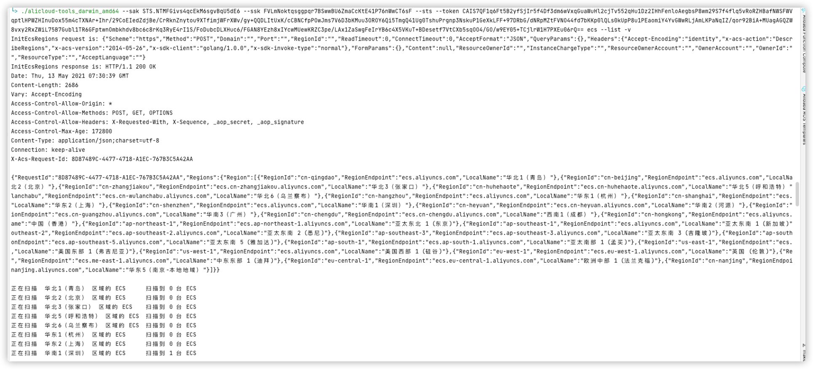
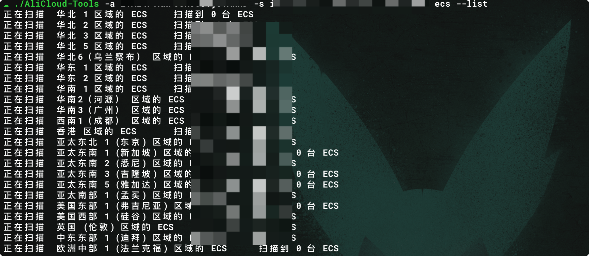
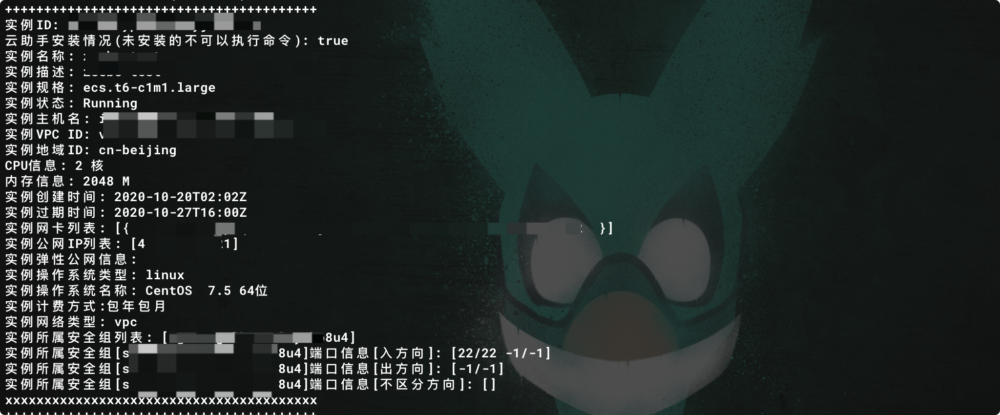
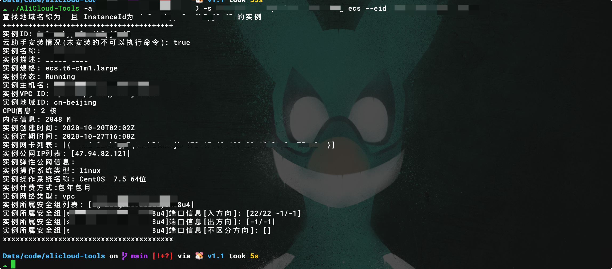
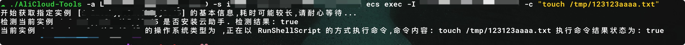
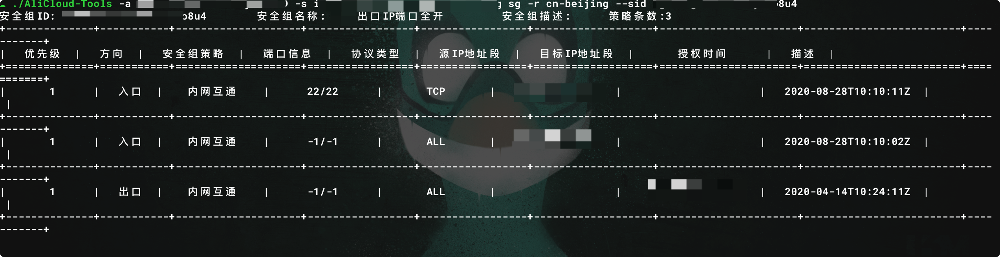
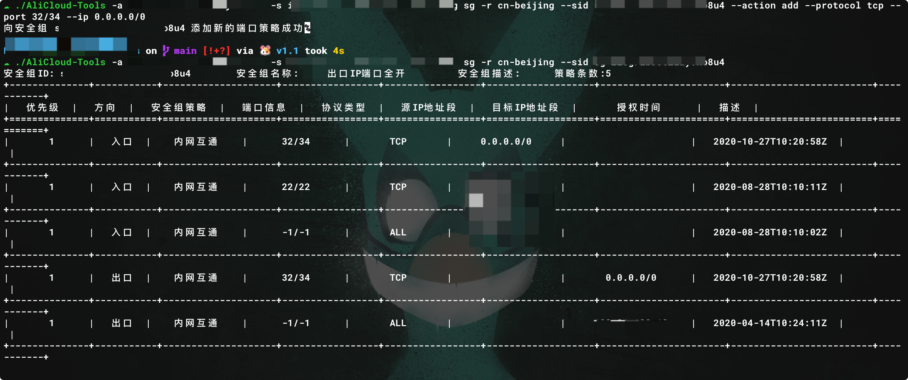
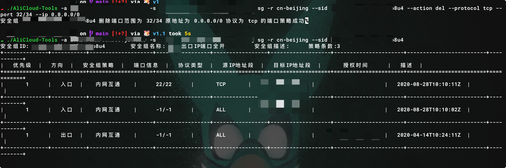

# AliCloud-tools

> 本工具为辅助使用阿里云API操作ECS以及策略组的小工具,如用于非法用途,与本人无关,出现任何问题,后果自负.

# 使用方式

```
该工具主要是方便快速使用阿里云api执行一些操作

Usage:
  AliCloud-Tools [flags]
  AliCloud-Tools [command]

Available Commands:
  ecs         ECS 操作(查询/执行命令),当前命令支持地域ID设置.
  help        Help about any command
  sg          安全组操作,当前命令支持地域ID设置.

Flags:
  -a, --ak string      阿里云 AccessKey
  -h, --help           help for AliCloud-Tools
      --regions        显示所有地域信息
  -r, --rid string     阿里云 地域ID,在其他支持rid的子命令中,如果设置了地域ID,则只显示指定区域的信息,否则为全部.
      --sak string     阿里云 STS AccessKey
  -s, --sk string      阿里云 SecretKey
      --ssk string     阿里云 STS SecretKey
      --sts            启用STSToken模式
      --token string   阿里云 STS Session Token
  -v, --verbose        显示详细的执行过程
```

# 关于使用STSToken

**如果需要使用STSToken,则需要指定sak\ssk\token\sts 四个选项。** ,如下图所示



## 查看所有地域信息
```
./AliCloud-Tools -a <AccessKey> -s <SecretKey> --regions
```

## 查看所有实例信息
```
./AliCloud-Tools -a <AccessKey> -s <SecretKey> ecs --list

```




## 查看所有正在运行的实例信息
```
./AliCloud-Tools -a <AccessKey> -s <SecretKey> ecs --list --runner

```


## 查看指定实例的信息
```
./AliCloud-Tools -a <AccessKey> -s <SecretKey> [-r <regionId>] ecs --eid <InstanceId>
```


## 执行命令
```
./AliCloud-Tools -a <AccessKey> -s <SecretKey> [-r <regionId>] ecs exec -I <InstanceId[,InstanceId,InstanceId,...]> -c "touch /tmp/123123aaaa.txt"
```



## 查看安全组策略
```
./AliCloud-Tools -a <AccessKey> -s <SecretKey> -r <regionId> sg --eid <SecruityGroupId>
```


## 增加安全组策略
```
./AliCloud-Tools -a <AccessKey> -s <SecretKey> -r <regionId> --eid <SecruityGroupId> --action add --protocol tcp --port 0/0 --ip 0.0.0.0/0
```


## 删除安全组策略
```
./AliCloud-Tools -a <AccessKey> -s <SecretKey> -r <regionId> --eid <SecruityGroupId> --action del --protocol tcp --port 0/0 --ip 0.0.0.0/0

```

